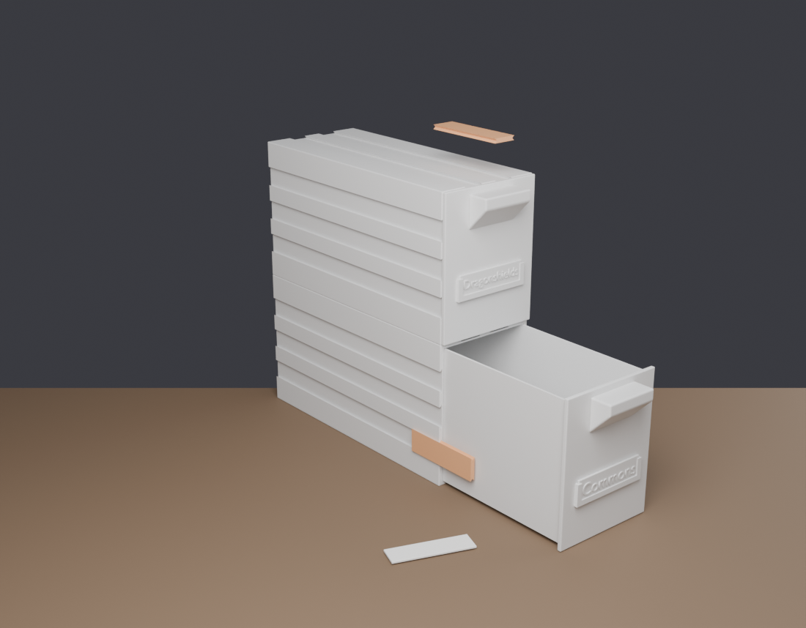

# Sistema modular de armazenamento de cartas (TCG)

Modelo 3D paramétrico, gerado por script no Blender e pronto para impressão 3D.
Cada módulo é uma caixa com gaveta e **sulcos em rabo de andorinha** nas quatro
faces externas — os módulos se unem entre si (empilhados ou lado a lado) por meio
de uma chave que desliza nos sulcos.



## Peças

| Peça | Arquivo | O que é |
|---|---|---|
| Casco | `stl/shell.stl` | corpo do módulo, com os sulcos de encaixe |
| Gaveta | `stl/drawer.stl` | bandeja + frente + puxador |
| Chave | `stl/key.stl` | clipe de rabo de andorinha duplo que trava dois módulos |

Um módulo completo = 1 casco + 1 gaveta. As chaves são consumíveis: use 2 por
junta (uma em cada sulco da face) — ou as 3 disponíveis nas laterais, se quiser
uma união bem rígida.

## Dimensões (configuração padrão)

| | mm |
|---|---|
| Externo do casco (L × P × A) | 80 × 195 × 103,4 |
| Profundidade total com a frente da gaveta | 198 |
| Espaço interno por gaveta (L × P × A) | 70 × 190 × 95 |
| Capacidade | ~306 cartas com sleeve duplo (~422 com sleeve simples) |
| Parede do casco | 3,0 mm |
| Parede/fundo da gaveta | 1,6 mm |
| Folga gaveta ↔ casco | 0,4 mm por lado |

O espaço interno de 70 × 95 mm acomoda carta padrão de 63 × 88 mm já com sleeve
duplo (perfect fit + sleeve normal), com folga.

### Sulcos de encaixe

Rabo de andorinha com abertura de 6 mm na superfície, 1,6 mm de profundidade e
flancos a **45°** (auto-sustentáveis, imprimem sem suporte). São 2 sulcos no topo
e na base e 3 em cada lateral, correndo por toda a profundidade — a chave entra
deslizando pela traseira.

Como topo/base e as duas laterais usam as mesmas posições, qualquer módulo encaixa
em qualquer outro, em qualquer das duas direções.

## Como gerar / editar o modelo

O modelo é gerado por script, então qualquer medida pode ser alterada sem
modelar nada à mão.

```bash
# com o Blender instalado
blender --background --python tcg_storage.py -- --export

# ou com o Blender como módulo Python (pip install bpy)
python tcg_storage.py --export
```

Isso escreve os STL em `stl/`. Para abrir a cena no Blender e ajustar à mão:

```bash
blender --background --python tcg_storage.py -- --save-blend tcg_storage.blend
blender tcg_storage.blend
```

O arquivo `tcg_storage.blend` já vem pronto no repositório, com as três peças
separadas lado a lado.

### Parâmetros mais usados

```bash
python tcg_storage.py --export --depth 150          # módulo mais curto
python tcg_storage.py --export --drawers 3          # 3 gavetas no mesmo casco
python tcg_storage.py --export --card-w 72          # cartas mais largas
python tcg_storage.py --export --gap 0.3            # gaveta mais justa
python tcg_storage.py --export --key-clear 0.15     # chave mais firme
python tcg_storage.py --help                        # lista completa
```

Todas as cotas estão na classe `Params`, no topo de `tcg_storage.py`, com
comentários.

| `--depth` | altura do casco ao imprimir em pé | capacidade (sleeve duplo) |
|---|---|---|
| 150 | 155 mm | ~241 cartas |
| 190 (padrão) | 195 mm | ~306 cartas |
| 220 | 225 mm | ~354 cartas |

### Verificação

```bash
python validate.py
```

Confere, por interseção booleana real, que a gaveta fechada não colide com o
casco, que a chave desliza nos sulcos do topo, da base e das laterais, que dois
módulos empilhados/lado a lado não se interpenetram e que todas as malhas são
fechadas (manifold). Rode isso depois de mudar qualquer parâmetro.

### Preview

```bash
python preview.py --out preview.png --stack 2
```

## Impressão

**Orientação** (importante — evita suportes e pontes):

- **Casco:** em pé, apoiado na traseira, com a boca para cima. Todas as paredes
  ficam verticais, os sulcos ficam verticais e não há nenhuma ponte sobre a
  cavidade. Exige ~200 mm de altura útil na impressora.
- **Gaveta:** deitada, fundo na mesa, frente em pé. A rampa inferior do puxador
  é de 45°, portanto ele se sustenta sozinho.
- **Chave:** deitada, eixo paralelo à mesa. Os flancos a 45° imprimem limpos.

**Configuração sugerida:**

| | |
|---|---|
| Altura de camada | 0,2 mm |
| Perímetros | 3 |
| Preenchimento | 15% (giroide ou grid) |
| Suportes | nenhum |
| Material | PLA ou PETG |

Sem suporte em nenhuma peça. O casco padrão consome ~205 cm³ de material
(~250 g) e a gaveta ~126 cm³ (~155 g), então imprimir vários módulos leva tempo —
reduzir `--depth` é a forma mais direta de economizar.

**Ajuste de encaixe.** Impressoras variam. Se a gaveta ficar dura, aumente
`--gap` para 0,5; se ficar frouxa, use 0,3. Se a chave ficar apertada demais,
aumente `--key-clear` para 0,25; se ficar solta, reduza para 0,15. Imprima uma
chave (leva poucos minutos) e teste no sulco antes de imprimir tudo.

## Estrutura do repositório

```
tcg_storage.py      gerador paramétrico (peças + exportação de STL)
validate.py         verificação de encaixes e de malha
preview.py          render de apresentação
tcg_storage.blend   cena Blender com as três peças
stl/                STL prontos para fatiar
preview.png         imagem de referência
```